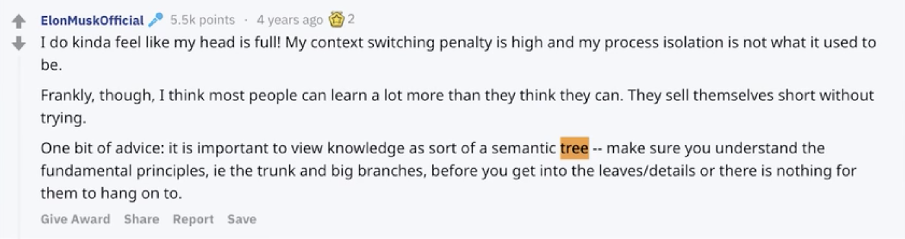

## 关于如何精通一个领域？

精通一个领域一般分为三步

1. Chunk it up 切碎知识点
2. Deliberate Practicing 刻意练习
3. Feedback 反馈
   - 主动式反馈
   - 被动式反馈

### 1. Chunk it up 切碎知识点

- 庖丁解牛
- 脉络连接

ElonMuskOfficial:

I do kinda feel like my head is full! My context switching penalty is high and my process islation is not what it used to be.

Frankly, though, I think most people can lean a lot more than they think they can. They sell themselves short without trying.

One bit of advice: **it is important to view knowledge as sort of a semantic tree** -- make sure you understand the fundamental principles, ie the trunk and big branches, before you get into the leaves/details or there is nothing for them to hang on to.

### 2. Deliberate Practicing 刻意练习

#### 游戏（CS、LOL、吃鸡、星际）

- 控兵
- 运营
- 战术
- 热键操作 VS 鼠标操作
- ...

和寝室室友一盘一盘打，这样的练习永远达不到专业的水平。想要达到职业水平，就需要把每一个部分单独拿出来练习。比如控兵练习三个月的时间，运营练习三个月。

在任何一个领域，如果要做到非常职业的水平的话，都必须要刻意练习。

#### 这种职业化运动

- 基本功是区别业余和职业选手的根本
- 把基础动作进行分解训练和反复练习 ---> 最大误区，算法题一遍是完全不够的，必须要练习 5 遍及以上。

#### Deliberate Practicing

刻意练习 -- 过遍数（五遍刷题法，无毒神掌）

刷题的技巧：

##### 1. 切题四件套（四步系统化地思考题目的方式）

1. 首先要把题看懂 Clarification
2. 想出所有可能的解法 Possibial Solution
   - 时间空间复杂度对比分析 Compare（time/space）
   - 加强 Optimal
3. 写代码 Coding
4. 测试样例 Test Cases

##### 2. 五遍刷题法（五毒神掌）

刷题第一遍：

1. 解读+思考：5 分钟
2. 直接看解法：注意！看多个解法，比较解法优劣
3. 背诵、默写好解法

刷题第二遍：

1. 马上自己写（不看别人的代码，相当于闭卷考试）
2. Debug -> 修改，循环往复，直到代码能跑通
3. 多种解法比较，体会 --> 优化！（查看执行时间和内存消耗）

刷题第三遍：

1. 过了一天后，再重复做题
2. 不同解法的熟练程度不一样的话，对自己不熟练的题目进行专项训练 --> 专项练习

刷题第四遍：

1. 一周之后：反复回来练习相同的题目
2. 对自己不熟悉的题目进行专项练习

刷题第五遍：

1. 面试前一个周恢复性训练
2. 把之前做的题全部都做一遍

### 3. Feedback 反馈

- 及时反馈
- 主动式反馈（自己去找）
  - 查看高手代码（GitHub、LeetCode、etc.）
  - 第一视角直播
- 被动式反馈（高手给你指点）
  - code review
  - 教练看你打，给你反馈
