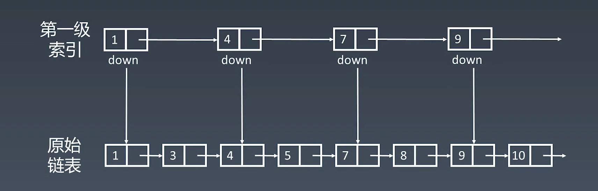
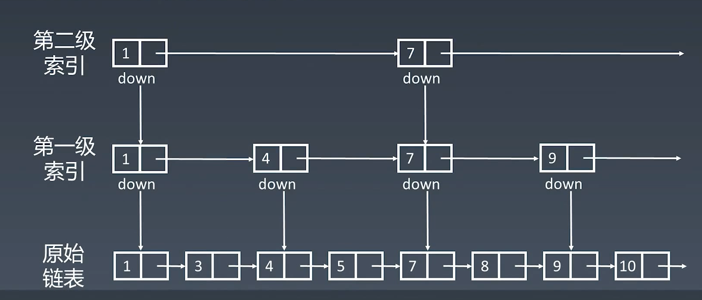
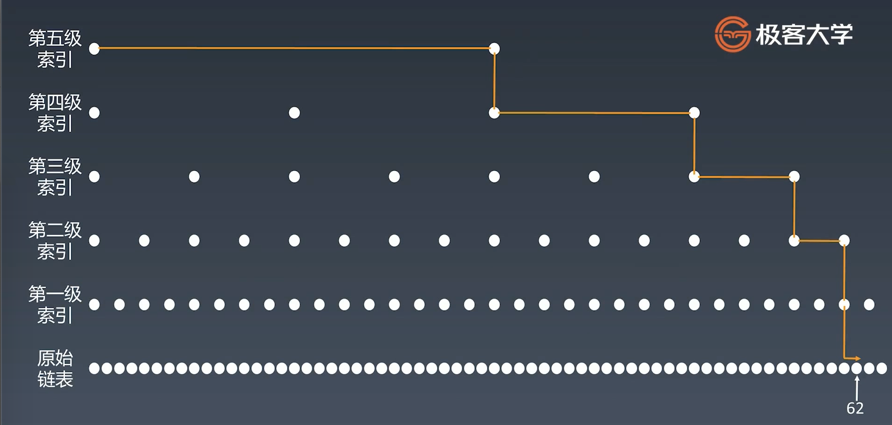
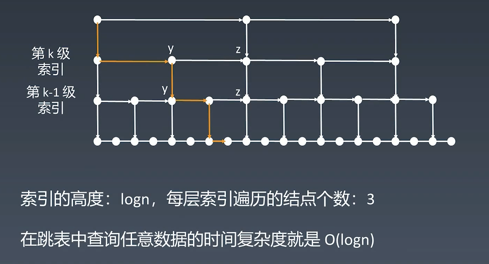

### 优化任何一个数据结构的思想

升维思想

用空间换时间

#### 如何给链表加速？

时间复杂度：

* 查询：O(n)

简单优化：

* 添加头尾节点

然后呢？

添加第一级索引

如何提高表线性查找的效率？

添加第二级索引

添加多级索引

跳表的时间复杂度分析

查询：

n/2, n/4, n/8, 第k级索引节点的个数是 n/(2^k)

假设索引有h级，最高级的索引有2个节点。n/(2^k) = 2，从而求得h = log2(n) - 1

