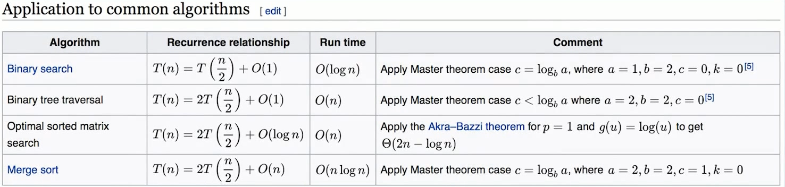

## 算法时间复杂度

通常使用 Big O notation （大O表示法）

时间复杂度的全称是**渐进时间复杂度（asymptotic time complexity），表示算法的执行时间与数据规模之间的增长关系。**

空间复杂度的全称是**渐进空间复杂度（asymptotic space complexity），表示算法的存储空间与数据规模之间的曾长关系。**

### 常见的算法时间复杂度有：

#### 多项式量级：

* O(1)：Constant Complexity 常数时间复杂度
* O(logn)：Logarthmic Complexity 对数时间复杂度
* O(n)： Linear Complexity 线性时间复杂度
* O(nlogn)：n倍对数时间复杂度
* O(n^2)：N Sequare Complexity 平方时间复杂度
* O(n^3)：N Cube Complexity 立方时间复杂度
* O(n^k)：k次方阶时间复杂度

#### 非多项式量级：

* O(2^n)：Exponential Growth 指数
* O(n!)：Factorial 阶乘

我们把时间复杂度为非多项式量级的算法问题叫做NP（Non-Deterministic Polynomial，非确定多项式）问题。

当数据规模n越来越大时，非多项式量级算法的执行时间会急剧增加，求解问题的执行时间会无限增长。所以，非多项式时间复杂度的算法其实是效率非常低的算法。

## 主定理 Master Theorem

用来解决所有递归函数怎么计算时间复杂度。

 

## 最好、最坏、平均、均摊时间复杂度

### 最好时间复杂度（best case time complexity）

顾名思义**最好情况复杂度就是，在最理想的情况下，执行一段代码的时间复杂度。**

### 最坏时间复杂度（worst case time complexity）

最坏情况复杂度就是，在最糟糕的情况下，执行一段代码的时间复杂度。

### 平均时间复杂度（average case time complexity）

我们都知道，最好情况时间复杂度和最坏情况时间复杂度对应的都是极端情况下的代码复杂度，发生的概率其实并不大。为了更好地表示平均情况下的复杂度，我们需要引入另一个概念：平均情况时间复杂度，后面我简称为平均时间复杂度。

平均时间复杂度又该怎么分析呢？我还是借助刚才查找变量 x 的例子来给你解释。

要查找的变量 x 在数组中的位置，有 n+1 种情况：**在数组的 0～n-1 位置中**和**不在数组中**。我们把每种情况下，查找需要遍历的元素个数累加起来，然后再除以 n+1，就可以得到需要遍历的元素个数的平均值，即：

我们知道，时间复杂度的大 O 标记法中，可以省略掉系数、低阶、常量，所以，咱们把刚刚这个公式简化之后，得到的平均时间复杂度就是 O(n)。

这个结论虽然是正确的，但是计算过程稍微有点儿问题。究竟是什么问题呢？我们刚讲的这 n+1 种情况，出现的概率并不是一样的。我带你具体分析一下。（这里要稍微用到一点儿概率论的知识，不过非常简单，你不用担心。）

我们知道，要查找的变量 x，要么在数组里，要么就不在数组里。这两种情况对应的概率统计起来很麻烦，为了方便你理解，我们假设在数组中与不在数组中的概率都为 1/2。另外，要查找的数据出现在 0～n-1 这 n 个位置的概率也是一样的，为 1/n。所以，根据概率乘法法则，要查找的数据出现在 0～n-1 中任意位置的概率就是 1/(2n)。

因此，前面的推导过程中存在的最大问题就是，没有将各种情况发生的概率考虑进去。如果我们把每种情况发生的概率也考虑进去，那平均时间复杂度的计算过程就变成了这样：

**这个值就是概率论中的加权平均值，也叫作期望值**，所以平均时间复杂度的全称应该叫**加权平均时间复杂度**或者**期望时间复杂度**。

引入概率之后，前面那段代码的加权平均值为 (3n+1)/4。用大 O 表示法来表示，去掉系数和常量，这段代码的加权平均时间复杂度仍然是 O(n)。

你可能会说，平均时间复杂度分析好复杂啊，还要涉及概率论的知识。实际上，在大多数情况下，我们并不需要区分最好、最坏、平均情况时间复杂度三种情况。像我们上一节课举的那些例子那样，很多时候，我们使用一个复杂度就可以满足需求了。只有同一块代码在不同的情况下，时间复杂度有量级的差距，我们才会使用这三种复杂度表示法来区分。

### 均摊时间复杂度（amortized time complexity）

对一个数据结构进行一组连续操作中，大部分情况下时间复杂度都很低，只有个别情况下时间复杂度比较高，而且这些操作之间存在前后连贯的时序关系，这个时候，我们就可以将这一组操作放在一块儿分析，看是否能将较高时间复杂度那次操作的耗时，平摊到其他那些时间复杂度比较低的操作上。而且，在能够应用均摊时间复杂度分析的场合，一般均摊时间复杂度就等于最好情况时间复杂度。

